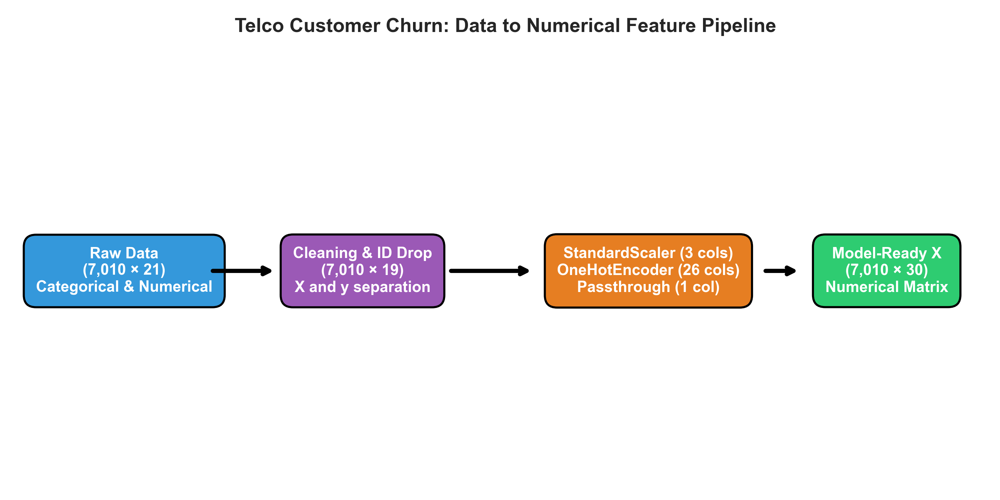
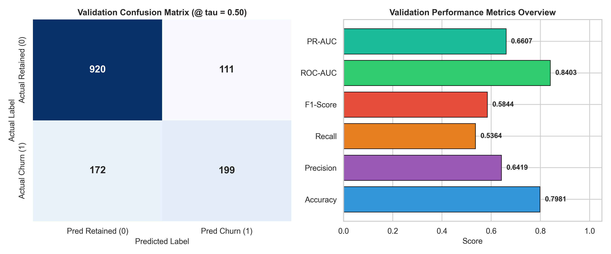
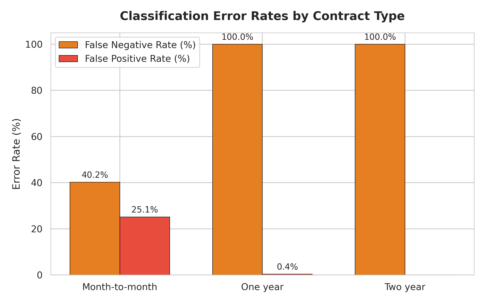
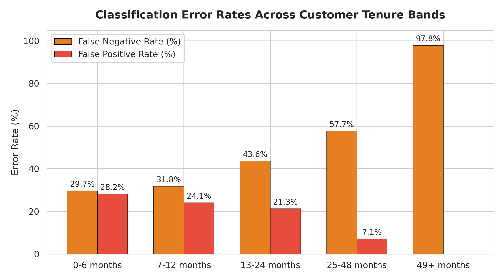
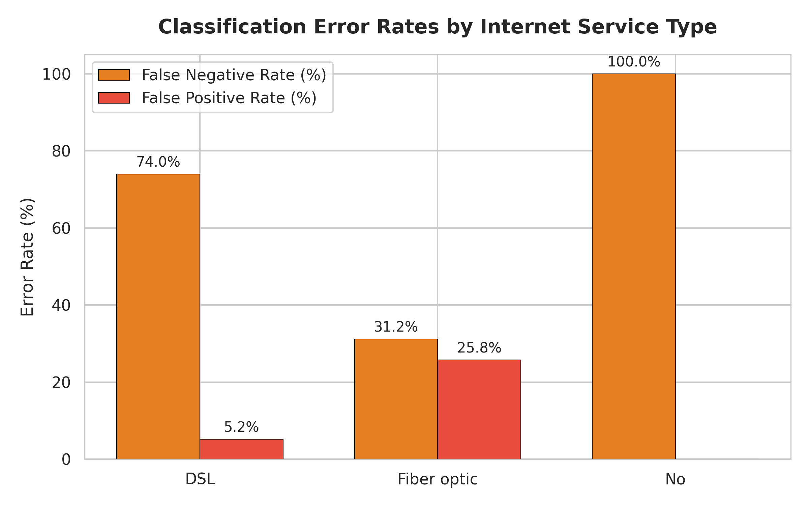
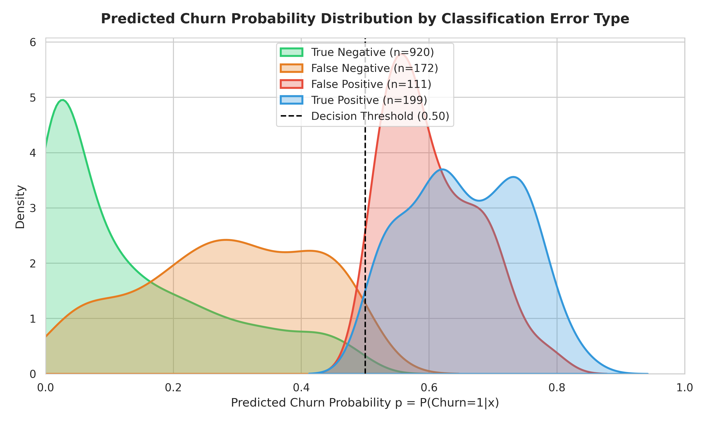
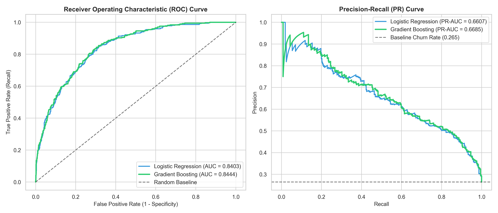

# ACM SIG AI — Telco Customer Churn

A machine-learning project built for the **ACM SIG AI recruitment task** using the IBM Telco Customer Churn dataset.
What I learned from this model
The first thing I understood is that ML models basically depend on mathematical structure.
If we use a different ML model, we are basically using a different mathematical structure. For example, we can have a Logistic Regression model, an HMM model, or different kinds of ML models. Underneath, everything is basically based on a mathematical structure.
Every machine-learning model uses a different mathematical structure and a different process to get to the point of making a prediction.

---

## 2. Dataset

The project uses the IBM Telco Customer Churn dataset.

The target variable is:

```text
Churn
Yes → 1
No  → 0
```

The dataset contains customer information such as:


from this information, i filter the data based on it datatype 

cleaning process:


after that i replace the empty cell with zero value (we can also do interpolarization method to find the missing data, but i didn't do that in this exercise
coz i thought it may take sometime. so, i went to navie approach here)
---

## 3. Data Cleaning and Preparation

We removed:

```text
33 duplicate rows
```

leaving:

```text
7,010 customers
```

after that i seperate the training data and target data into two different dataframe

here, what i mean by traning data is the dataframe without chunk column in it and target data is chunk column only

---

## 4. Target and Feature Data

After cleaning, the data is separated into:

```text
X = input features
y = target
```

where:

```text
X → customer information
y → Churn
```

The data is then split into training, validation, and test sets.


The preprocessing is fitted only on the training data. Validation and test data are transformed using the already-fitted preprocessing steps.

This prevents information from the validation/test sets leaking into the training process.

---

## 5. Converting the Table into a Numerical Representation

now, i convert the 60 % of train data that seperate from dataset into numerical representation

like i taken numerical datatype object and used standard scaling. then used one-hotencoding on categroical data

---

## 6. Logistic Regression

The primary model is Logistic Regression.

The basic structure is:

```text
Customer features
       ↓
Numerical matrix X
       ↓
Linear combination
       ↓
z = Xw + b
       ↓
Sigmoid
       ↓
Churn probability
```

The model learns a parameter for each feature.

Some learned coefficients from the baseline model were:


---

## 7. Validation Results


Accuracy alone was not used as the main measure because the dataset is imbalanced: only about 26.5% of customers churn.


---

## 8. Project Structure

```text
ACM-SIG-AI-TELCO-CHURN/
│
├── README.md
├── requirements.txt
├── .gitignore
│
├── data/
│   ├── raw/
│   └── processed/
│
├── src/
│   ├── config.py
│   ├── data/
│   │   ├── loader.py
│   │   ├── cleaner.py
│   │   └── splitter.py
│   │
│   ├── preprocessing/
│   │   └── pipeline.py
│   │
│   ├── model/
│   │   ├── train.py
│   │   └── predict.py
│   │
│   ├── evaluation/
│   │   ├── metrics.py
│   │   └── analysis.py
│   │
│   └── from_scratch/
│       └── logistic_regression.py
│
├── pipelines/
│   ├── data_pipeline.py
│   ├── training_pipeline.py
│   └── evaluation_pipeline.py
│
├── models/
│   ├── logistic_regression.pkl
│   └── preprocessor.pkl
│
├── results/
│   ├── analysis/
│   ├── figures/
│   └── predictions/
│
└── report/
    └── one_page_writeup.md
```

---

## 9. Visual Results

### Data → Numerical Representation



---

### Logistic Regression Evaluation



---

### Classification Error Analysis



---

### Error Across Tenure



---

### Error Across Internet Service



---

### Probability Distribution



---

### Logistic Regression vs Gradient Boosting



---

## 14. Main Takeaway

This project started as a churn-classification task, but the main thing I took from it was the underlying idea of machine learning:

> **We take something from reality, represent it as data, convert that data into a mathematical form, choose a mathematical structure to approximate the relationship, estimate its parameters from observations, and then test how well that approximation works on unseen data.**

The model is not reality.

It is an approximation of reality.

The quality of that approximation depends on the data, the representation, the mathematical structure, the parameters, and how honestly we evaluate it.
